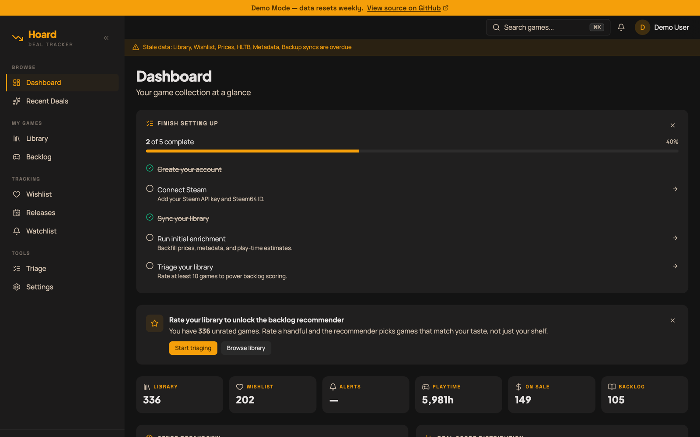
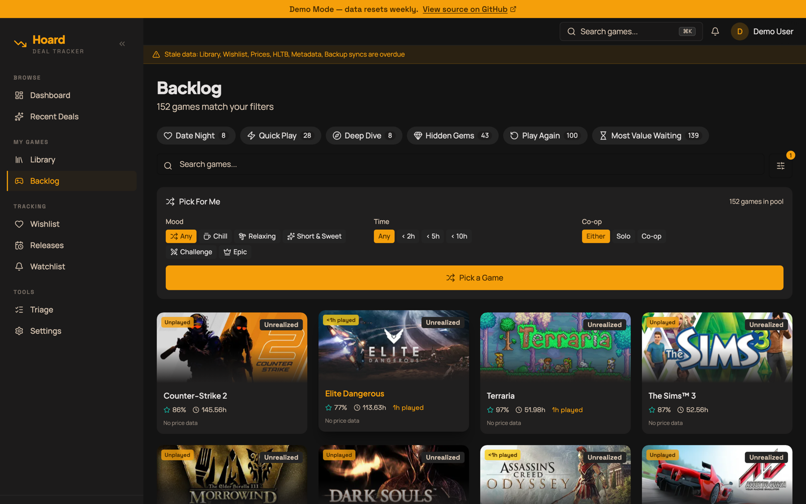
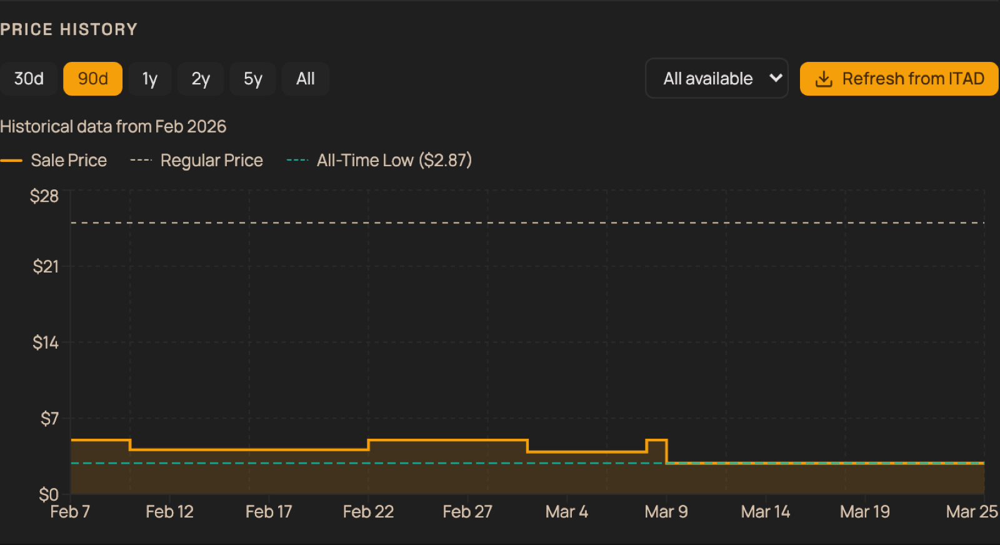

# Hoard

[](https://github.com/smithadifd/hoard/actions/workflows/ci.yml)
[](LICENSE)

**Never overpay for a game again.**

Hoard is a self-hosted web app that tracks game deals across stores, manages your Steam library and backlog, and helps you decide what to play next — all from a single dashboard.

## Why This Exists

Paid deal trackers and wishlist services lock price history, backlog planning, and value scoring behind subscriptions and hand your data to someone else. Hoard is a free, self-hosted alternative that puts wishlist tracking, backlog recommendations, and value-per-hour scoring in one place — and keeps every byte of your data on your own machine.

## Screenshots

| Dashboard | Backlog recommender | Price history |
|-----------|--------------------|----------------|
| [](docs/screenshots/dashboard.png) | [](docs/screenshots/backlog.png) | [](docs/screenshots/price-history.png) |

## Live Demo

Try Hoard without installing anything: **[hoard.smithadifd.com](https://hoard.smithadifd.com)**

Login with `demo@example.com` / `demo1234!` — data resets weekly, mutations are disabled.

## What It Does

- **Library sync** — imports your Steam library and wishlist automatically
- **Price tracking** — monitors prices across 30+ stores via [IsThereAnyDeal](https://isthereanydeal.com), with historical lows and deal quality indicators
- **Value scoring** — combines price, reviews, and estimated play time (via HowLongToBeat) into a configurable deal score
- **Backlog recommender** — filters your unplayed games by mood, duration, co-op support, and more, with a "pick for me" randomizer
- **Price alerts** — set thresholds per game and get notified on Discord when prices drop
- **Mobile-ready** — installable PWA with a responsive layout

## Tech Stack

| Layer | Technology |
|-------|------------|
| Framework | Next.js 16 (App Router) / TypeScript |
| Database | SQLite via Drizzle ORM |
| Styling | Tailwind CSS + shadcn/ui |
| Auth | Better Auth (credentials-based) |
| Price Data | IsThereAnyDeal API v2 |
| Game Duration | HowLongToBeat |
| Notifications | Discord Webhooks |
| Scheduling | node-cron (in-process) |
| Deployment | Docker Compose |

## Quick Start

### Prerequisites

- Node.js 22+
- Steam API key ([get one](https://steamcommunity.com/dev/apikey))
- IsThereAnyDeal API key ([register](https://isthereanydeal.com/dev/app/))

### Run Locally

```bash
git clone https://github.com/smithadifd/hoard.git
cd hoard
npm install
cp .env.example .env.local
# Fill in your API keys in .env.local
npm run db:push
npm run dev
```

Open [http://localhost:3000](http://localhost:3000) and create your account on first visit.

### Run with Docker

```bash
cp .env.example .env.production
# Fill in your API keys
docker compose up -d
```

For production deployment behind a reverse proxy, see `docker-compose.prod.yml` and the [self-hosting guide](https://smithadifd.github.io/hoard/self-hosting/).

## Configuration

All configuration is done through environment variables (see `.env.example`) and the in-app Settings page:

- **Scoring weights** — tune how much price, reviews, value-per-hour, and personal interest affect deal scores
- **Cron schedules** — control how often prices and library data sync
- **Alert thresholds** — set per-game price targets or track all-time lows
- **Discord webhooks** — separate channels for deal alerts and ops notifications

Full reference: the [configuration guide](https://smithadifd.github.io/hoard/self-hosting/configuration/).

## Architecture

Hoard follows a **cache-first** pattern: all external API data syncs into SQLite on a schedule, and the UI reads exclusively from the database. This keeps pages fast and resilient to API outages.

```
Steam API  --> sync --> SQLite <-- UI
ITAD API   --> sync --|
HLTB       --> sync --|
```

Key design decisions:
- **SQLite** — single-file database, no separate container, trivial backups
- **In-process cron** — simpler than a separate worker; fine at this scale
- **Server Components** — data fetching happens server-side by default

## Features in Detail

### Value Scoring Engine

Every deal gets a composite score based on configurable weights:

| Factor | What it measures |
|--------|-----------------|
| Price Score | How close to the all-time low |
| Review Score | Steam review percentage and volume |
| Value Score | $/hour relative to review-tier thresholds |
| Interest Score | Your personal 1-5 rating |

### Backlog Recommender

Surfaces unplayed and underplayed games from your library with smart filters:

- **Mood presets** — Chill, Challenge, Epic, or Any
- **Time-based** — "I have 2 hours" filters by HLTB duration
- **Co-op** — find games to play with someone else
- **Hidden gems** — highly rated but less popular titles
- **Play again** — games you haven't touched in months

### Price History

Tracks price snapshots over time with interactive charts showing trends, all-time lows, and best-price-per-day across stores.

## Backup & Restore

SQLite makes backups simple:

```bash
./scripts/backup.sh                    # default: ./data/backups/
./scripts/backup.sh /path/to/backups   # custom path
./scripts/restore.sh                   # list available backups
./scripts/restore.sh <backup-file>     # restore (creates safety backup first)
```

## Development

```bash
npm run dev          # start dev server
npm test             # run tests (Vitest)
npm run lint         # ESLint
npm run db:studio    # Drizzle Studio (DB browser)
```

## Contributing

Bug reports and pull requests are welcome. See [CONTRIBUTING.md](CONTRIBUTING.md) for the quick start, conventions, and CI gate, and the [documentation site](https://smithadifd.github.io/hoard/) for deeper reference.

## Support This Project

Hoard is free and self-hosted. If it saves you money or you just want to help keep it maintained, you can support development:

- [GitHub Sponsors](https://github.com/sponsors/smithadifd)
- [Ko-fi](https://ko-fi.com/smithadifd)

Starring the repo and reporting bugs helps just as much.

## License

[MIT](LICENSE)
