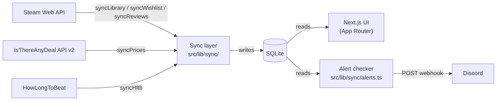

Every page in Hoard reads from SQLite. No page or API route calls Steam, IsThereAnyDeal, or HowLongToBeat at request time. External data comes in through scheduled sync tasks that write to the database; the UI reads whatever is there. This means the app stays fast regardless of upstream API latency or outages, and all the data is local.

## Data flow

Discord is outbound only. No data flows from Discord into the database.

## Service layer

Each external API has a dedicated client class in `src/lib/{source}/`:

- `src/lib/steam/client.ts` — exports `getSteamClient(): SteamClient`
- `src/lib/itad/client.ts` — exports `getITADClient(): ITADClient`
- `src/lib/hltb/client.ts` — exports `getHLTBClient(): HLTBClient`
- `src/lib/discord/client.ts` — exports `getDiscordClient(): DiscordClient`

Each `getXxxClient()` function returns a singleton instance — the object is constructed once and reused across calls within the same process. Error handling is isolated inside each client; a failure in HLTB won't propagate to a price sync, and vice versa.

Rate limiting lives inside each sync module, not the client. `syncHltb` waits 1 second between searches. `syncReviews` waits 3 seconds between games (it makes two Steam API calls per game). The ITAD client sends games in batches of up to 200 in a single request.

All clients are server-side only. None are imported in any `'use client'` component.

## Scheduler

Tasks are registered and started in `src/instrumentation.ts`, which Next.js runs once on server boot (Node.js runtime only). The scheduler module is `src/lib/scheduler/index.ts`.

### Registered tasks

| Task name | Default schedule | Override env var | Notes |
|---|---|---|---|
| `price-check` | `0 */12 * * *` (every 12 h) | `CRON_PRICE_CHECK` | Chains into alert check + release status check on completion |
| `library-sync` | `0 3 * * *` (3 am daily) | `CRON_LIBRARY_SYNC` | |
| `wishlist-sync` | `0 1 * * *` (1 am daily) | `CRON_WISHLIST_SYNC` | |
| `hltb-sync` | `0 2 * * 0,3` (2 am Sun + Wed) | `CRON_HLTB_SYNC` | Processes up to 100 games per run; stale after 90 days |
| `review-enrichment` | `0 4 * * 2,5` (4 am Tue + Fri) | `CRON_REVIEW_SYNC` | Processes up to 100 games per run; stale after 30 days |
| `database-backup` | `0 4 * * *` (4 am daily) | `CRON_BACKUP` | Uses `better-sqlite3` `.backup()` for WAL-safe atomic copy |
| `snapshot-prune` | `0 3 1 * *` (3 am on the 1st) | none | Deletes price snapshots older than 180 days |
| `health-summary` | `0 9 * * 1` (9 am Monday) | none | Sends weekly sync health digest to Discord |

The `snapshot-prune` and `health-summary` tasks have hardcoded schedules and no env var override.

### Chained tasks

`syncPrices` (`price-check`) calls two tasks inline after it finishes:

1. `checkPriceAlerts` from `src/lib/sync/alerts.ts` — evaluates active watchlist entries and auto-ATL candidates against the fresh snapshots, then sends Discord notifications
2. `checkReleaseStatus` from `src/lib/sync/releases.ts` — checks unreleased wishlist games against the Steam Store API to detect newly released titles

These two run inside the price-check's own execution, not as separate scheduled tasks. If either fails, the error is logged but does not fail the price-check itself.

### Concurrent-run guard

`registerTask` wraps each function with an `isRunning` boolean stored on the task record in the scheduler's `Map<string, ScheduledTask>`. When a cron tick fires, the wrapper checks `taskInfo.isRunning` before calling the function. If it's `true`, the tick is skipped and logged. This is a simple in-process mutex — adequate for a single-instance deployment.

If the process restarts mid-run, the `isRunning` flag is lost. On startup, `src/instrumentation.ts` cleans up any `sync_log` rows stuck in `'running'` status for more than 5 minutes by marking them `'error'` with the message `"Process restarted — sync did not complete"`.

In demo mode (`DEMO_MODE=true`), `registerTask` logs a skip message and returns early, so no tasks are ever registered or started.

## Database

Hoard uses SQLite via [Drizzle ORM](https://orm.drizzle.team/) and `better-sqlite3`. The connection is a singleton returned by `getDb()` in `src/lib/db/index.ts`. WAL mode is enabled at startup along with a 32 MB page cache, 128 MB memory-mapped I/O, and a 5-second busy timeout.

The schema is defined in `src/lib/db/schema.ts`. Core tables:

- `games` — central entity; Steam metadata, review scores, HLTB durations, co-op/multiplayer flags
- `tags` — genres, categories, and Steam tags (type: `'genre'`, `'category'`, or `'tag'`)
- `game_tags` — many-to-many join between `games` and `tags`
- `user_games` — per-user relationship to a game: ownership, wishlist status, watchlist status, playtime, personal interest (1-5), price threshold, notes
- `price_snapshots` — one row per store per sync run; includes current price, regular price, discount percent, historical low, and computed deal score
- `price_alerts` — watchlist configuration: target price, notify-on-ATL flag, throttle tracking
- `settings` — key/value store for app config (scoring weights, API keys)
- `sync_log` — one row per sync run; source, status (`'running'` / `'success'` / `'partial'` / `'error'`), item counts, timestamps
- `user`, `session`, `account`, `verification` — Better Auth tables

## Why this shape

The cache-first model trades immediacy for resilience. A live API call on every page load would mean any upstream hiccup — HLTB rate-limiting, Steam being slow — becomes a user-facing failure. With everything in SQLite, the UI degrades gracefully: data might be a few hours old, but it's always there.

The tradeoffs behind these choices — SQLite over PostgreSQL, in-process cron over a separate worker, Drizzle over raw SQL — are covered in [Design decisions](/design-decisions/).
